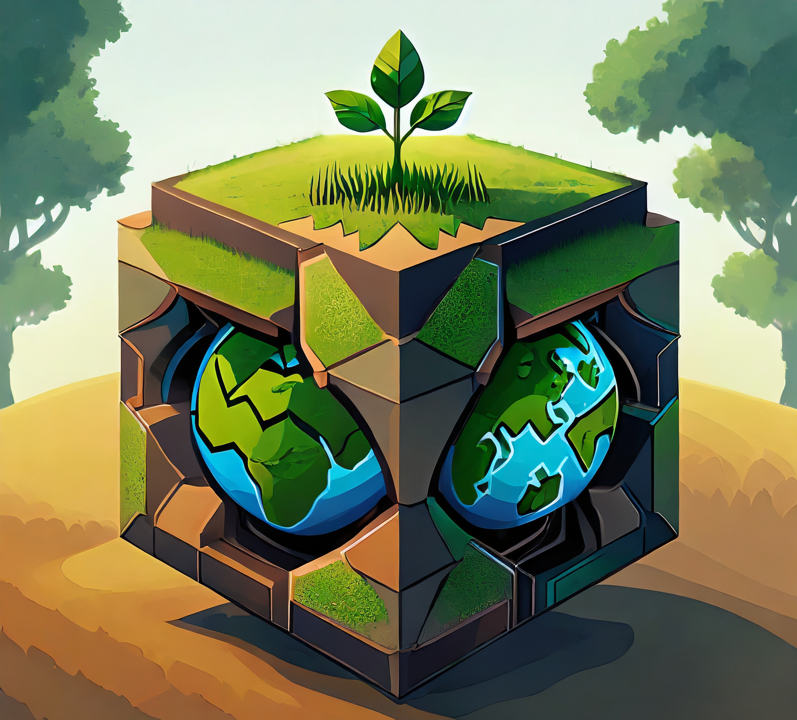
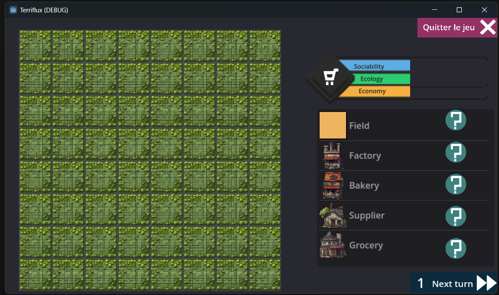
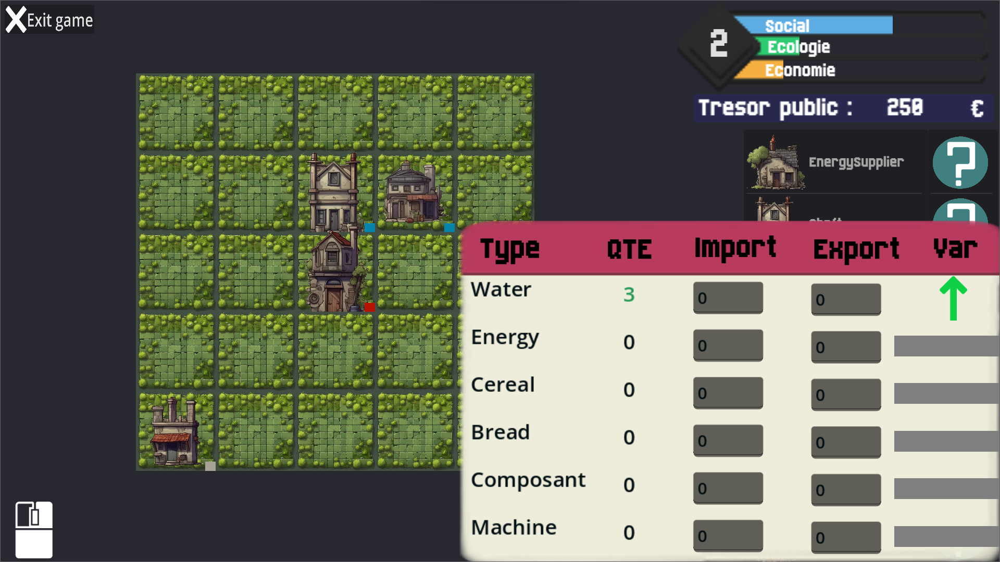

# T3 - Terriflux

## Equipe
- FERNANDES Samuel
- LE ROUX Aymeric
- GILLIG Mattéo
- Tejedinne

## Logo du Jeu

## Concept
Ce jeu est une simulation de construction et de gestion urbaine avec un focus sur le quartier de Koenigshoffen-Est à Strasbourg. Il vise à explorer et à enseigner les concepts du métabolisme urbain et de la re-territorialisation par la matière.

## Problématique
Re-territorialiser par la matière. Approche du métabolisme urbain à l'échelle d'un quartier - spécifiquement, Koenigshoffen-Est à Strasbourg.

## Objectifs Pédagogiques
- Comprendre l'impact du métabolisme urbain et de la re-territorialisation sur un quartier spécifique.
- Appréhender les défis et opportunités de la gestion d'un quartier urbain dans une perspective de développement durable.
- Comprendre l'influence des flux de marchandise sur l'occupation d'un territoire

## Technologie
- Moteur de jeu : Godot Engine .Net 4.0

## Fonctionnalités Essentielles
- Simulation détaillée d'un territoire.
- Gestion des ressources et planification urbaine basée sur des principes de durabilité.
- Interactions dynamiques reflétant les défis réels de la gestion urbaine.

## Méthode de Développement
- Développement axé sur la simulation réaliste des défis urbains.
- Collaboration avec des experts en géographie et en développement urbain pour assurer l'authenticité.

## Installation
Installez le zip ici ___inserer le lien entre les signes < et >___ et lancez l'éxecutable.

## Utilisation
Le jeu plonge le joueur dans les défis de la gestion d'un quartier urbain, avec un accent sur la durabilité et le métabolisme urbain.

Une fois arrivé sur le menu principal, vous pourrez : 
- accéder à votre inventaire pour inspecter les ressources en votre possessions
- cliquer sur la liste des bâtiments puis l'une des case de la grille représentant votre territoire (ou inversement) afin de l'y construire.
- voir l'impact de votre territoire sur le bien des habitants, l'écologie et l'economie de votre ville via les jauges correspondantes

## Contribuer
Toute remarque ou suggestion est la bienvenue ! N'hésitez pas à nous en faire par lors de la présentation.

## Licence
GNU General Public License v3.0 (GPLv3).

## Contact
Pour toute question, contactez l'équipe de dev.

## Images du Jeu
Quelques images du jeu :

